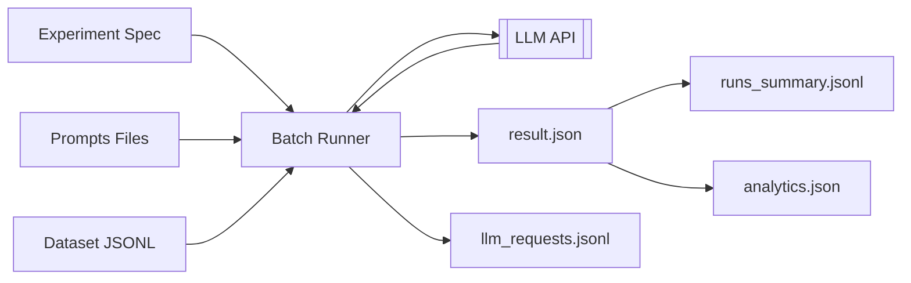
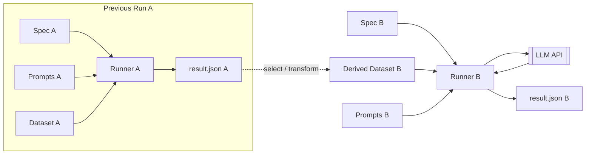

# Experiment Harness (OpenAI & Azure OpenAI)

Pragmatic tooling to define, run, chain and evaluate LLM experiments with optional structured outputs.

Lean concepts only: experiment spec (+ prompts + dataset) -> run -> single JSON artifact + logs -> lightweight analytics.

## 1. Install & Env

```powershell
uv python install 3.13
uv sync --all-extras   # includes azure + dev + notebooks
```

Create `.env` (copy from sample if present):

```text
OPENAI_API_KEY=...
AZURE_OPENAI_API_KEY=...
AZURE_OPENAI_ENDPOINT=https://<your>.openai.azure.com
AZURE_OPENAI_API_VERSION=2025-04-01-preview
```

## 2. CLI Basics

Commands live under `exp`.

```powershell
uv run exp list                 # list all experiments
uv run exp show acq_yaml        # show experiment details for experiment acq_yaml
uv run exp run acq_yaml         # run experiment acq_yaml
uv run exp run acq_yaml --limit 3 --dry-run
uv run exp run acq_yaml --override temperature=0.2 --override max_output_tokens=256
uv run exp chain run investor_followup   # run multiple experiments chained together
```

While running you see panels with the raw response (truncated). After completion a summary panel shows tokens, latency, and a sample output.

## 3. Experiment Mental  Flow

### 3.1 Single Experiment



### 3.2 Chaining Experiments



## 3. Defining Experiments

Location: `experiments/<name>/`.

Two forms:

1. YAML (`experiment.yaml`)
2. Python (`experiment.py` implementing `get_experiment()` returning `ExperimentSpec`)

Minimal YAML example:

```yaml
name: acq_yaml
description: Structured acquisition extraction
model: gpt-4o-mini
provider: azure
schema_model: app.schemas.extraction.AcquisitionExtraction
system_prompt: prompts/system/extraction.txt
user_prompt: prompts/user/extraction.jinja
instructions:
  - prompts/instructions/guidelines.txt
dataset: ../../datasets/samples.jsonl
temperature: 0.0
max_output_tokens: 512
depends_on: []
```

Python example sketch:

```python
from app.experiments.definitions import ExperimentSpec

def get_experiment() -> ExperimentSpec:
    return ExperimentSpec(
        name="python_extraction",
        description="Free-form summary",
        model="gpt-4o-mini",
        provider="azure",
        schema_model=None,  # free-form
        system_prompt="../acq_yaml/prompts/system/extraction.txt",
        user_prompt="../acq_yaml/prompts/user/extraction.jinja",
        instructions=None,
        dataset="../../datasets/samples.jsonl",
        temperature=0.3,
        max_output_tokens=400,
    )
```

## 4. Structured vs Free‑form

If `schema_model` is set we attempt structured parsing (Pydantic) with fallback to standard text if the API rejects the schema; output is validated post‑hoc. Otherwise the raw text is returned.

Record shape in `result.json` (simplified):

```json
{
  "input": {...original dataset row...},
  "output": { "field": "value" } | { "text": "..." } | { "refusal": "..." } | { "error": "..." },
  "validated": true,
  "validation_errors": null,
  "meta": {
    "usage": {"prompt_tokens": 123, "completion_tokens": 456, ...},
    "latency_ms": 842.1,
    "refusal": null,
    "parse_fallback": false
  }
}
```

## 5. Outputs

Each run: `src/output/<experiment>/<timestamp>/` containing:

- `result.json` (single artifact)
  - `manifest`: experiment + config snapshot + dependency run refs + token summary + avg latency
  - `metrics`: counts, token totals, latency list (raw) – quick stats
  - `records`: array of per‑record outputs
  - (optional) `evaluation`: added by evaluation pipeline
- `prompts_used.json`: system, user template, instruction texts
- `logs/llm_requests.jsonl`: raw_request and raw_response entries (sanitized)
- `runs_summary.jsonl`: appended run-level summaries (one line per run, lives in experiment root)
- `analytics.json`: aggregated longitudinal stats (cumulative tokens, rolling averages, extremes)
- `latest.txt`: pointer to latest timestamp

Legacy multi-file artifacts (`results.jsonl`, `manifest.json`, `metrics.json`, `prompts/` folder) are deprecated; fallback readers remain only for dependency + eval compatibility.

## 6. Chaining

Add entries under `depends_on` in the spec. For each dependency the latest run is read (prefers `result.json`), a selection path extracts the portion used as the downstream dataset. Optional transform can reshape the list.

## 7. Overrides

Repeat `--override key=value` to temporarily change scalar spec fields (e.g. temperature, max_output_tokens). These are captured inside `manifest.config` for the run.

## 8. Evaluation

```powershell
uv run exp eval run src/output/acq_yaml/<timestamp>
```

Adds an `evaluation` block into `result.json` (field coverage, validation rate, error rate). Falls back to writing `metrics.json` only if legacy layout detected.

## 9. Logging & Analytics

Per-request JSONL log lines:

```jsonl
{"event":"raw_request", ...}
{"event":"raw_response", ...}
```

Analytics file (`analytics.json`) summarizes across all runs of an experiment (no embedding of full recent runs to keep size small): counts, averages, extremes, rolling last 5 window, cumulative token totals.

## 10. Dev Tooling

```powershell
uv run fmt       # format (ruff)
uv run lint      # lint (ruff)
uv run typecheck # mypy
```

## 11. Notebooks

Lightweight exploratory and demo workflows live under `notebooks/` and operate directly on `result.json` artifacts (no bespoke loaders needed):

- `01_experiment_walkthrough.ipynb`: Lean interactive quickstart — load or draft an experiment (ephemeral), preview a dataset, run with limit / dry‑run, then analyze the latest run (manifest, metrics, sample records, history charts, raw request log snippet).

Add new notebooks freely; keep them self‑contained and prefer pure reads over mutating run directories (other than creating new runs via the runner).

## 12. Gotchas / Tips

- Large outputs: live preview truncates at ~1200 chars for terminal readability.
- Structured parsing fallback: if strict parse fails we retry with JSON schema; if still unusable we keep raw text for manual inspection.
- Dependency selection paths use dot notation over the record root.
