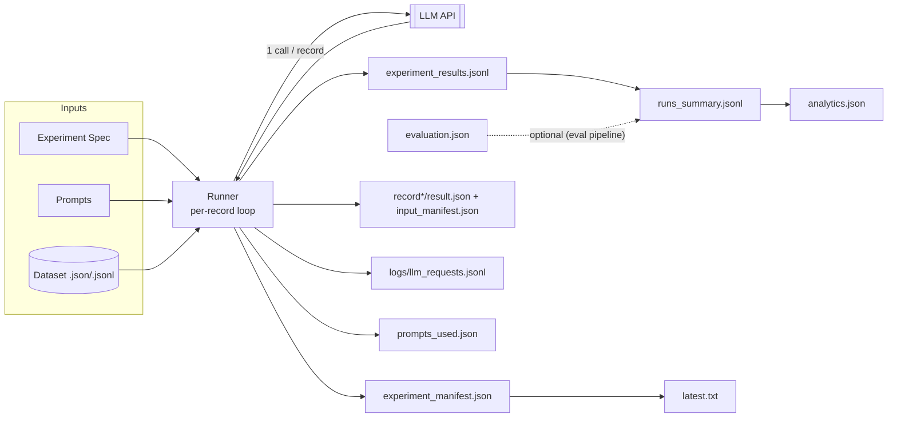
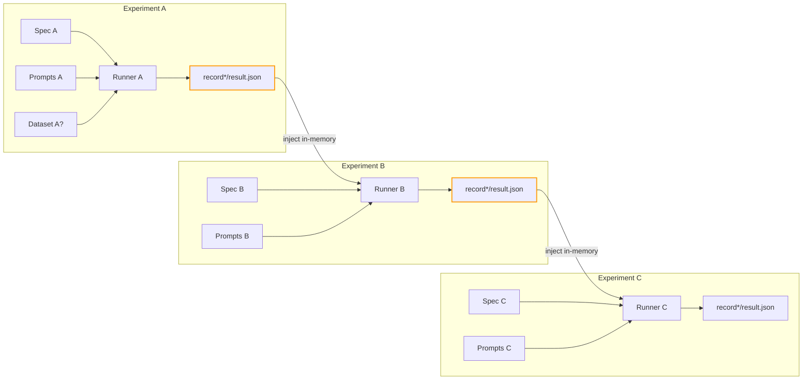

# Experiment Harness (OpenAI & Azure OpenAI)

This project is an easy and  ready to go harness to define (datasets, prompts, instructions), run(OpenAI AzureOpenAI), chain and evaluate LLM experiments.

## 1. Install & Env

```powershell
uv python install 3.13
uv sync --all-extras   # includes azure + dev + notebooks
```

Create `.env` (copy from sample if present):

```text
OPENAI_API_KEY=...
AZURE_OPENAI_API_KEY=...
AZURE_OPENAI_ENDPOINT=https://<your>.openai.azure.com
AZURE_OPENAI_API_VERSION=2025-04-01-preview
```

## 2. CLI Basics

Commands live under `exp`.

```powershell
uv run exp list                 # list all experiments
uv run exp show acq_yaml        # show experiment details for experiment acq_yaml
uv run exp run acq_yaml         # run experiment acq_yaml
uv run exp run acq_yaml --limit 3 --dry-run
uv run exp run acq_yaml --override temperature=0.2 --override max_output_tokens=256
uv run exp chain run acq_yaml investor_followup   # chain: outputs of acq_yaml feed investor_followup
```

While running you see panels with the raw response (truncated). After completion a summary panel shows tokens, latency, and a sample output.

## 3. Experiment Mental  Flow

### 3.1 Single Experiment



### 3.2 Chaining Experiments

When you run:

```powershell
uv run exp chain run expA expB expC
```

the outputs of each experiment (each `recordN/result.json`) are loaded in‑memory and become the dataset for the next experiment.  If experiment A produces N records, experiment B receives N injected records (unless you limit or apply `record_selection`). If `record_selection` is omitted for a chained experiment, ALL upstream records are processed. Downstream on‑disk `dataset` definitions are ignored when upstream injected records are present (the chain data takes precedence).

Each injected record is the JSON of the prior run's `recordN/result.json` with an added convenience alias `upstream_output` (copy of `output` dict) to simplify Jinja templates: e.g. `{{ upstream_output.field }}`.

Inter‑request pacing: a fixed 2s delay between LLM calls within a run (except dry‑run) to reduce rate spikes. The LLM client performs exactly one network call per record (no hidden retries or fallback second calls), ensuring strict idempotence.



## 3. Defining Experiments

Location: `experiments/<name>/`.

Two forms:

1. YAML (`experiment.yaml`)
2. Python (`experiment.py` implementing `get_experiment()` returning `ExperimentSpec`)

YAML example:

```yaml
name: acq_yaml
description: Structured acquisition extraction
model: gpt-4o-mini
provider: azure
schema_model: app.schemas.extraction.AcquisitionExtraction
system_prompt: prompts/system/extraction.txt
user_prompt: prompts/user/extraction.jinja
instructions:
  - prompts/instructions/guidelines.txt
dataset: ../../datasets/samples.jsonl
temperature: 0.0
max_output_tokens: 512
depends_on: []
```

Python example :

```python
from app.experiments.definitions import ExperimentSpec

def get_experiment() -> ExperimentSpec:
    return ExperimentSpec(
        name="python_extraction",
        description="Free-form summary",
        model="gpt-4o-mini",
        provider="azure",
        schema_model=None,  # free-form
        system_prompt="../acq_yaml/prompts/system/extraction.txt",
        user_prompt="../acq_yaml/prompts/user/extraction.jinja",
        instructions=None,
        dataset="../../datasets/samples.jsonl",
        temperature=0.3,
        max_output_tokens=400,
    )
```

## 4. Structured vs Free‑form output

If `schema_model` is set we attempt structured parsing (Pydantic) with fallback to standard text if the API rejects the schema; output is validated post‑hoc. Otherwise the raw text is returned.

Per-record slim result shape (`recordN/result.json`):

```json
{
  "input": {...dataset row...},
  "output": { "field": "value" } | { "text": "..." } | { "refusal": "..." } | { "error": "..." },
  "validated": true,
  "validation_errors": null,
  "meta": {
    "usage": {"prompt_tokens": 123, "completion_tokens": 456, ...},
    "latency_ms": 842.1,
    "refusal": null,
    "parse_fallback": false
  }
}
```

## 5. Outputs

Each run directory: `src/output/<experiment>/<timestamp>/` contains:

1. `experiment_manifest.json` – top-level object with:

* `manifest`: config snapshot (name, model, provider, schema, record_selection, token_usage, avg_latency)
* `metrics`: summarized counts (records, validations, token totals, success_pct, refusals, parse_fallbacks, latency distribution)

1. `experiment_results.jsonl` – newline-delimited slim per-record result objects (no original input to keep small).

1. `recordN/` folders – one per processed dataset record (1-based index):

* `input_manifest.json` (index + original input)
* `result.json` (slim result for that record – mirrors lines in the aggregate JSONL)

1. `prompts_used.json` – snapshot of system prompt, user template source, and concatenated instructions used for reproducibility.

1. `logs/llm_requests.jsonl` – per API call: raw_request / raw_response / structured parse events (sanitized tokens & timing).

1. `runs_summary.jsonl` – (experiment root) one line per run summarizing tokens, success pct, latency, run_dir.

1. `analytics.json` – aggregated historical statistics (averages, extremes, cumulative tokens, rolling last-5 window).

1. `latest.txt` – simple pointer to the latest timestamp directory.

1. `evaluation.json` – added by evaluation pipeline (field coverage & validation metrics) – separate file (no mutation of results).

Removed: previous monolithic `result.json` (merged manifest+records) and legacy `results.jsonl`. Fallback readers eliminated except for dependency resolution scanning `experiment_results.jsonl` then `record*/result.json`.

## 7. Overrides

Repeat `--override key=value` to temporarily change scalar spec fields (e.g. temperature, max_output_tokens). These are captured inside `manifest.config` for the run.

## 8. Evaluation

```powershell
uv run exp eval run src/output/acq_yaml/<timestamp>
```

Creates `evaluation.json` alongside other artifacts (field coverage, validation rate, error rate). It does not mutate existing artifacts.
